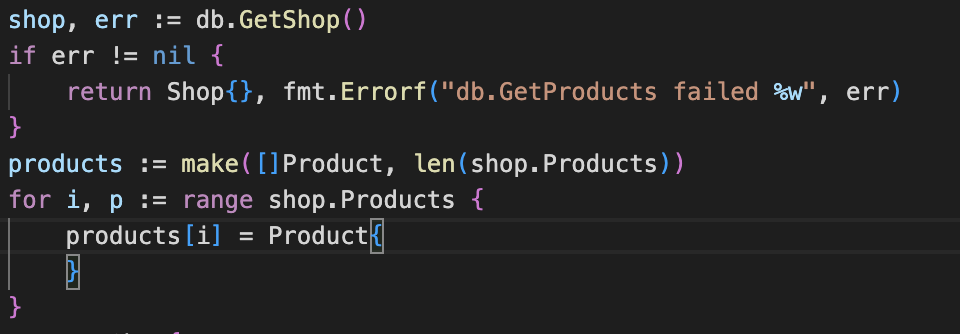
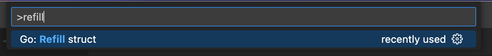
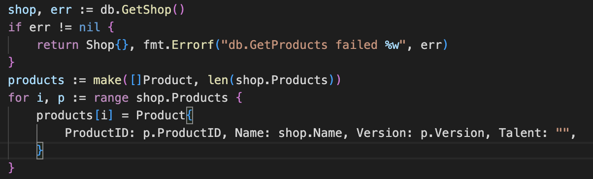

# VSCode Go Refactoring Tools

Open the command pallette (⌘ + P) and type the command name

## Commands

### Refill Struct

Automatically fill the struct values with defined fields of other variables or defaults.

## License

MIT License

Forked from [vscode-go](https://github.com/golang/vscode-go)
